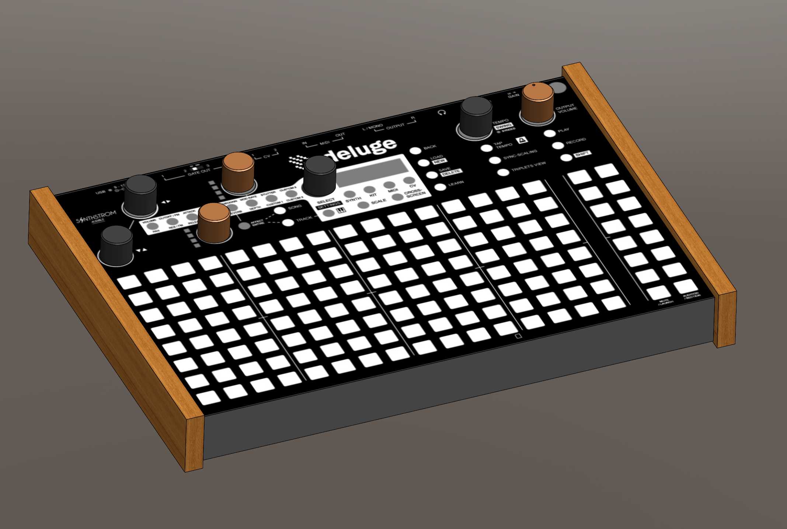

# deluge
I would like to built a custom case and other accessories for the [deluge synthstrom](https://synthstrom.com/product/deluge/). So I started of with creating a CAD-model of the deluge itself.

# references
cover picture taken from the [deluge google doc manual](https://docs.google.com/document/d/1FAeJ5f1sl3kKJgvbKmGRe3PIMjkaYrh3eAXF05PAV6k)

# license
 This work is licensed under a <a rel="license" href="http://creativecommons.org/licenses/by-nc-sa/4.0/">Creative Commons Attribution-NonCommercial-ShareAlike 4.0 International License</a>.
